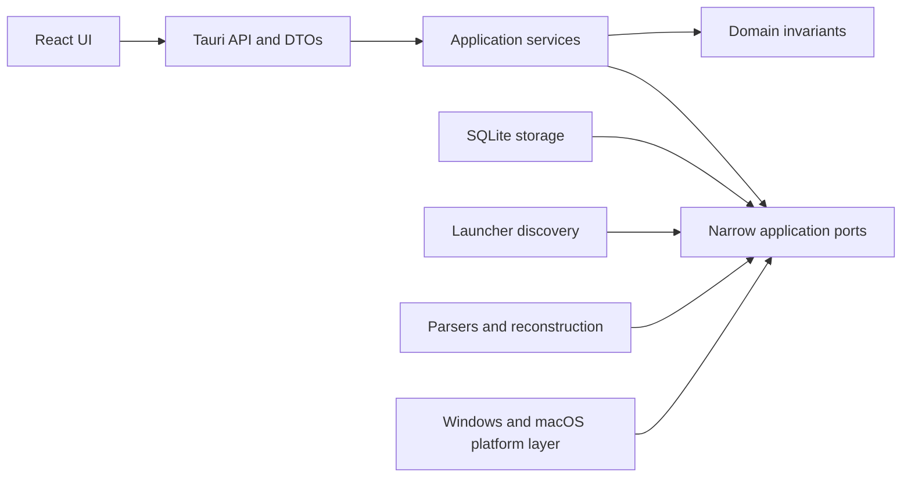
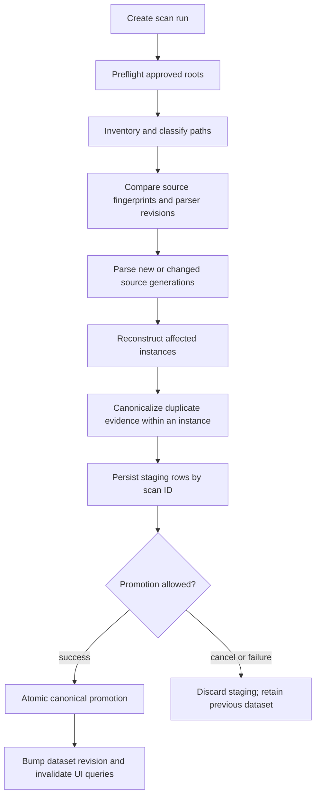

# MineTrace Backend Architecture

This document is the backend implementation handoff for MineTrace. It reflects the current Tauri 2 and Rust implementation and records the boundaries that keep scanning provenance-aware, private, and cross-platform.

## Status

The current implementation provides:

- A Tauri 2 native shell with the dialog plugin and minimum window capabilities.
- A Rust application state initialized from Tauri-owned app directories.
- A local SQLite database created in `AppLocalData/minetrace.sqlite3`.
- Eight embedded, transactional, checksum-verified migrations.
- Standard-path discovery for the Official Launcher and Prism Launcher on Windows, macOS, and Linux.
- Weighted multi-marker validation for game directories, launcher roots, and single Prism-style instance folders.
- Native path encoding, stable location identifiers, and persisted custom locations.
- Structured command errors.
- A symlink-safe, bounded log inventory and streaming BLAKE3 fingerprint pipeline.
- Plain/gzip Minecraft log parsing with timestamp provenance, lossy UTF-8 tolerance, lifecycle/destination/crash rules, deterministic cross-rotation reconstruction, and decoded-byte/line/evidence resource limits.
- Durable scan runs, cooperative cancellation, incremental source generations, JSON staging, and one-transaction canonical promotion/rollback.
- Tauri commands for discovery, custom locations, dashboard/session/explorer reads, and scan start/status/cancel.
- Database-backed Overview, Sessions, Instances, Worlds, Servers, and Versions read models. Browser builds never substitute sample records.
- Tests for migrations, discovery, validation, path handling, parser fixtures, reconstruction, source generations, atomic promotion, missing-source retention, and idempotent rescans.

World/NBT/statistics parsing, mod metadata, corrections, export, and more launcher adapters remain deferred and are not exposed as working controls.

## Product invariants

Backend changes must preserve these invariants:

1. Minecraft files are opened read-only and never modified.
2. No account token, password, or authentication cache is read.
3. No private data leaves the computer by default.
4. A calculated value is traceable to source revisions, ranges, event roles, and confidence.
5. Missing evidence is never converted into invented precision.
6. A cancelled or failed scan does not replace the last completed dataset.
7. Manual corrections overlay inferred data instead of mutating source-derived rows.
8. Windows and macOS use the same domain and application logic; operating-system branches remain inside the platform layer.

## Dependency direction

The backend uses a practical layered architecture. Tauri commands are adapters, not service implementations.



The intended rules are:

- `domain` does not depend on Tauri, SQLite, filesystem APIs, or frontend types.
- `api` owns command registration, serialization, and public errors only.
- `application` owns use cases and transaction boundaries.
- `storage`, `discovery`, `parser`, and `platform` implement application needs.
- SQL rows and `PathBuf` values are converted before crossing the API boundary.
- No frontend command accepts raw SQL or unrestricted filesystem operations.

The backend is one Rust crate. Splitting it into workspace crates is unnecessary until compile time, reuse, or ownership boundaries justify it.

## Module map

```text
src-tauri/src/
├── lib.rs                         Tauri builder, plugins, commands
├── main.rs                        Desktop entry point
├── bootstrap.rs                   App directories, DB, recovery, AppState
├── state.rs                       Managed application services
├── error.rs                       Internal BackendError
├── api/
│   ├── commands.rs                Thin async command adapters
│   ├── dto.rs                     Frontend-facing location DTO
│   └── error.rs                   Structured serializable ApiError
├── application/
│   ├── dashboard_service.rs       SQLite-backed analytics/session read models
│   ├── explorer_service.rs        SQLite-backed instance/world/server/version read models
│   ├── discovery_service.rs       Discovery and custom-location use cases
│   ├── scan_service.rs            Worker lifecycle, progress, cancellation, orchestration
│   ├── scan_models.rs             Frontend-facing scan status contract
│   └── read_models.rs             Dashboard contract shared with frontend
├── domain/
│   ├── confidence.rs              Fact-level confidence labels
│   ├── evidence.rs                Parser evidence vocabulary
│   ├── location.rs                Platform, adapter, and validation types
│   └── session.rs                 Session invariants
├── discovery/
│   ├── adapter.rs                 LauncherAdapter implementations
│   ├── candidates.rs              Standard OS-specific candidates
│   ├── registry.rs                Enabled adapter registry
│   └── validation.rs              Weighted multi-marker validation
├── parser/
│   ├── minecraft_log.rs           Streaming evidence parser and diagnostics
│   ├── session_reconstruction.rs  Pure deterministic session builder
│   └── source_classifier.rs       Path-component source classification
├── platform/
│   ├── paths.rs                   Platform-owned directory context
│   └── path_codec.rs              Native path BLOB encoding and IDs
├── storage/
│   ├── database.rs                SQLite open, PRAGMAs, recovery
│   ├── evidence_repository.rs     Normalized reconstruction staging/promotion
│   ├── migrations.rs              Embedded migration runner
│   ├── repository.rs              Location/installation/instance persistence
│   └── scan_repository.rs         Runs, generations, staging, promotion, rollback
├── scan/                           Safe inventory, fingerprints, durable scan models
├── privacy/                        Reserved redaction boundary
└── export/                         Reserved export boundary
```

As scanning lands, add focused files under the existing boundaries rather than expanding `commands.rs` or `lib.rs` with business logic.

## Application bootstrap

At process startup:

1. Resolve `AppLocalData` through Tauri's Rust path resolver.
2. Create the application data and log directories.
3. Open `minetrace.sqlite3`.
4. Configure SQLite:
   - `foreign_keys = ON`
   - `journal_mode = WAL`
   - `synchronous = NORMAL`
   - five-second busy timeout
5. Verify and apply embedded migrations in order.
6. Mark abandoned `queued`, `running`, or `paused` scans as `interrupted`.
7. Remove staging rows belonging to interrupted scans.
8. Build application services and register `AppState` with Tauri.

Migration checksum mismatches are fatal. Applied migration files are immutable; a schema change always receives a new migration.

## Discovery model

Launcher adapters provide candidate roots. Candidates are not trusted until directory validation succeeds.

Current automatic candidates include:

| Platform | Official Launcher | Prism Launcher |
| --- | --- | --- |
| Windows | `%APPDATA%/.minecraft` | `%APPDATA%/PrismLauncher` |
| macOS | `~/Library/Application Support/minecraft` | `~/Library/Application Support/PrismLauncher` |
| Linux | `~/.minecraft` | `~/.local/share/PrismLauncher` |

Portable launchers and configuration redirects are not guessed. Users can add them explicitly until adapter-specific configuration readers exist.

Validation recognizes three shapes:

- A game directory with at least two meaningful markers such as `logs`, `versions`, `saves`, `options.txt`, `launcher_profiles.json`, `assets`, or `libraries`.
- A launcher root with an `instances` directory plus a launcher configuration or at least one recognizable instance game directory.
- A single instance directory containing a recognizable `.minecraft` child.

A single weak marker is insufficient. Validation produces a score, matched markers, a directory kind, an instance count, and a confidence label.

## Scan data flow

Scanning is a durable job, not a long-running command invocation. `start_scan` creates the durable run, starts a named worker thread, and returns the queued status immediately. The current frontend polls `get_scan_status` every 750 ms while a scan is active and every five seconds while idle; the status contract can later move to a Tauri channel without changing the worker or storage boundary.



### Scan stages

1. **Preflight** validates enabled locations, permissions, scan mode, and limits.
2. **Inventory** walks approved roots without following symlinks by default.
3. **Diff** classifies each path as new, changed, unchanged, forced reparse, or skipped.
4. **Parse** emits typed evidence into staging tables.
5. **Reconstruct** rebuilds all sessions for each affected instance. Reconstructing only the changed file is unsafe because session boundaries can cross files.
6. **Canonicalize** links rotated or duplicated evidence within one stored instance without deleting a source.
7. **Promote** uses one short `BEGIN IMMEDIATE` transaction to replace affected canonical data, complete the scan, and increment `dataset_state.revision`. Reserved day-slice tables are not populated by the current log slice; local-day grouping is computed from each session's observed offset at read time.

The UI reads only the last completed canonical dataset. Progress and staging state never leak into normal analytics queries.

## Source paths and generations

A logical path and the content observed at that path are different entities.

- `source_paths` identifies an approved-root-relative native path.
- `source_revisions` identifies a generation of content observed at that path.
- Evidence links to a source revision, not only to a path.

This distinction is necessary for `latest.log`:

- If its size grows and its prefix is unchanged, the next source generation is classified as an append.
- If it shrinks, its prefix changes, or its platform file identity changes, it becomes a new generation.
- When a rotated log reappears as a dated `.log.gz`, deduplication links both sources to canonical sessions.
- A source that disappears is marked missing. Previously imported history that depends on it remains available with missing provenance, while changed present sources continue to reconstruct and publish new sessions. A later unchanged scan is idempotent.

For the first scanner version, unchanged files are skipped and changed files are fully reparsed. Byte-offset continuation is deferred until rotation, truncation, UTF-8 boundary, and parser-checkpoint fixtures prove it safe.

## Evidence and session reconstruction

Parsers emit typed evidence rather than database-ready sessions. Initial event kinds include:

- Game started
- Minecraft version observed
- Server joined
- Local world joined
- Disconnected
- Clean shutdown
- Crash

Each event records:

- Source revision
- Stable event key
- Event order
- Line and byte range when known
- Original observed local timestamp
- Resolved UTC instant when possible
- UTC offset and timezone context
- Timestamp origin, such as log line, filename, or file modification time
- Confidence score
- Structured payload

The reconstructor consumes ordered evidence and produces sessions, evidence roles, source links, and destination observations. It is deterministic for the same evidence and reconstruction revision.

A session is one client launch. The schema can hold several server, world, or menu segments. The current log slice records each observed destination conservatively across the session boundary; precise join/disconnect sub-segmentation remains follow-up work.

## Schema and migration rationale

| Migration | Responsibility | Rationale |
| --- | --- | --- |
| `0001_core.sql` | Dataset revision, settings, approved locations, installations, instances, scan runs, messages | Establishes user-approved roots and durable job history before parsing. |
| `0002_sources.sql` | Logical source paths, source generations, per-scan decisions, staged files | Separates path identity from mutable content and enables incremental scans. |
| `0003_evidence_sessions.sql` | Evidence, inferred sessions, evidence/source links, servers, activity segments, staged evidence/sessions | Preserves provenance and supports multiple destinations in one launch. |
| `0004_user_state.sql` | Append-only corrections and materialized session user state | Keeps manual decisions separate from inferred source data and supports undo. |
| `0005_analytics.sql` | Session day slices and unique daily runtime | Reserves midnight allocation and de-overlapped daily aggregates. |
| `0006_incremental_scan_storage.sql` | Single-active-run constraint and typed staged location/source inventory | Makes generation decisions durable and lets interrupted work be discarded safely. |
| `0007_session_observation_metadata.sql` | Per-session Minecraft version, loader slot, and observed UTC offset | Prevents a later instance upgrade from rewriting historical session labels and keeps local-day grouping at the observed offset. |
| `0008_source_revision_lineage.sql` | Source-generation change kind | Lets promotion distinguish appended evidence from replaced path content and preserve prior imported history. |

SQLite tables use strict typing, foreign keys, enum checks, and indexes on common time and relationship queries. Instants are stored as epoch milliseconds. Public DTOs use RFC 3339 strings.

Raw log lines are not stored by default. Provenance uses source references, offsets, event types, and sanitized payloads. Debug raw-text retention, if ever added, must be opt-in and bounded.

## Manual corrections

The schema reserves a non-destructive correction model, but correction commands and controls are not part of the current log-evidence v1. When implemented, source-derived sessions remain immutable from the user's perspective.

- `corrections` is an append-only audit log containing the operation, typed patch, previous value, timestamp, and undo state.
- `session_user_state` materializes effective ignore, note, time, or destination overrides for fast reads.
- Reparse and parser upgrades replace inferred data while preserving compatible user corrections.
- Merge and split operations must store explicit membership, never destroy original evidence links.

## Commands and channels

### Implemented commands

| Command | Behavior |
| --- | --- |
| `discover_installations` | Returns validated automatic candidates plus persisted custom locations. |
| `add_custom_location` | Canonicalizes, validates, persists, and returns an approved location. |
| `get_dashboard` | Queries the last completed canonical dataset; returns a truthful empty archive before the first successful evidence scan. |
| `get_sessions` | Returns the newest 500 non-ignored reconstructed sessions with source/context/confidence fields plus the full canonical count and an explicit truncation flag. |
| `get_instances` | Returns up to 500 SQL-ranked canonical profile summaries plus the total/truncation state; absent mod inventory is `null`, never an invented zero. |
| `get_worlds` | Returns up to 500 SQL-ranked session-observed world summaries plus the total/truncation state and explicit whole-session-linked runtime basis. |
| `get_servers` | Returns up to 500 SQL-ranked multiplayer summaries plus the total/truncation state, without DNS or network access. |
| `get_versions` | Returns up to 500 deterministically ranked version summaries plus the total/truncation state, loader observations, confidence, counts, and reconstructed runtime. |
| `start_scan` | Creates one durable scan and starts the local worker; a concurrent request receives the active status or database constraint error. |
| `get_scan_status` | Returns active in-memory progress or hydrates the latest durable terminal run after relaunch, including counts, a bounded redacted issue list, and terminal state. |
| `cancel_scan` | Requests cooperative cancellation and waits briefly for confirmation; promotion is never partially cancelled. |

Commands return structured errors:

```text
ApiError {
  code,
  message,
  retryable,
  details?
}
```

Public messages are concise. Internal errors may contain developer detail, but logs and diagnostics must respect privacy redaction.

### Planned commands

- `locations_list`
- `locations_set_enabled`
- `locations_remove`
- `scan_pause`
- `scan_resume`
- `scan_list_recent`
- `session_get`
- `session_get_provenance`
- `session_apply_correction`
- `session_undo_correction`
- `export_sessions`
- `export_daily`
- `source_open`
- `source_reveal`
- `settings_get`
- `settings_update`

Command names already consumed by the frontend remain stable; planned pagination/filter parameters should be additive.

### Progress transport

The implemented worker maintains a mutex-protected `ScanStatus`, persists phase/counter snapshots on the durable scan run, and exposes it through `get_scan_status`. It includes:

- Job ID
- Phase
- Completed and total work
- Warning and error counts
- Optional privacy-safe display label
- Terminal state

The frontend polls every 750 ms during an active scan and every five seconds while idle. Progress remains in memory during a run; phase/counter snapshots and redacted warning/error records are durable in SQLite. On relaunch, `get_scan_status` restores the latest completed, cancelled, failed, or interrupted run, reports full warning/error counts, and returns at most the newest 20 issue details. A future IPC channel may reduce polling; it must preserve this DTO and cannot broaden filesystem access.

An app-shell monitor remains mounted across navigation and invalidates the dashboard, session, and explorer TanStack Query keys when polling observes a changed terminal run or dataset revision. No global dataset event is registered or claimed; an IPC event may replace polling later if it preserves the same revision boundary.

## Concurrency, pause, and cancellation

Only one mutating scan runs at a time. A second request returns the current job ID instead of starting competing writers.

The job registry owns:

- A cancellation token
- The latest progress snapshot

Concurrency remains bounded:

- One directory walk per root.
- One worker performs bounded reads sequentially, which limits open file handles and avoids unbounded parser queues.
- Each decoded log is capped at 256 MiB, each line at 512 KiB, each source at five million lines, and each source revision at 250,000 retained evidence events. Plain and gzip inputs share the same limits.
- Each instance is capped at 4,096 logs, 512 MiB of retained decoded input, 500,000 evidence events, and 100,000 canonical sessions. Session destinations, version observations, evidence links, and parsed strings have independent bounds.
- A scan is capped at 16,384 logs, 2 GiB of retained decoded input, one million evidence events, 200,000 reconstructed sessions, and 500,000 contexts. Exceeding an aggregate limit defers the affected instance atomically and preserves its prior archive.
- The canonical archive is capped at 250,000 sessions and one million contexts. Session and explorer IPC collections are SQL-limited to the newest or highest-ranked 500 rows and include total/truncation metadata; dashboard aggregation keyset-streams the full accepted archive.
- Gzip, hashing, filesystem traversal, and SQLite work run outside the UI thread.
- SQLite has one writer path; WAL readers remain available for dashboard queries.

Cancellation is checked at directory entries, read chunks or line boundaries, between files, before reconstruction, and before promotion. The final promotion transaction is short and non-pausable. Cancellation never increments the dataset revision.

The current implementation uses one mutex-protected SQLite connection. Reads and writes are short; parsing never holds the connection, and canonical promotion uses one short immediate transaction. A read pool is a measured optimization, not a prerequisite.

## Platform and path security

All Minecraft filesystem access occurs in Rust. The webview does not receive unrestricted filesystem plugin permissions.

The path policy is:

1. A standard adapter discovers a candidate or the user chooses a folder through the native dialog.
2. Rust canonicalizes the root while it exists.
3. Multi-marker validation approves or rejects it.
4. The approved root is stored as a platform-native BLOB key plus a lossy display string.
5. Future source commands accept opaque database IDs, resolve them under an approved root, and revalidate containment.

Path classification uses `Path::components()`. It never searches for Windows-only separator substrings such as `"\\stats\\"`, never lowercases an entire path, and does not assume UTF-8.

Symlink traversal is disabled by default. If enabled later, scanner traversal must detect loops and verify that resolved targets remain within user-approved scope. Network and removable locations require warnings, conservative concurrency, and graceful disconnection handling.

On macOS, a normal signed and notarized DMG is the first distribution target. App Store sandboxing is deferred because persistent external-folder access would require security-scoped bookmarks. Windows and macOS artifacts must be built and smoke-tested on native CI runners.

## Confidence and coverage are separate

MineTrace must not use one label for two different questions.

**Fact or session confidence** asks: how strong is the evidence for this particular timestamp, destination, or session?

- `verified`
- `high`
- `partial`
- `unknown`

Internally, a versioned numeric score produces the display label. Persisted, user-readable reason codes remain follow-up work; the current slice retains source links, evidence roles, event types, offsets, and confidence.

**Dataset coverage** asks: how much of the user's history is likely represented?

- `verified`
- `partial`
- `limited`
- `unknown`

Coverage considers missing periods, truncated files, duplicate rate, unknown roots, and the share of sessions with reliable boundaries. A verified session can exist inside a partial-history dataset. The quality formula must be versioned and documented; absence of a log is not proof of no play.

## Runtime metrics are separate

The primary session measure is detected client runtime, not guaranteed in-world playtime.

- **Client runtime** sums every reconstructed client session. Two simultaneous clients count twice.
- **Unique elapsed runtime** unions overlapping session intervals. Two simultaneous clients count once.
- **Activity-segment runtime** estimates time assigned to a server, world, or menu when join and disconnect evidence support it.
- **Minecraft statistics play time** is a separate world-specific source and must never be silently merged with session runtime.

The dashboard labels the first value as detected client runtime. Current all-time day/month slices are split at midnight using each session's observed fixed UTC offset; selectable date ranges and an explicit report-timezone control remain follow-up work.

## Testing pyramid

### Unit and property tests

- Filename dates, line timestamps, midnight rollover, and undated-log final-day anchoring
- Path classification and native path encoding
- Server address normalization, including bracketed IPv6
- Event rules and reconstruction invariants
- Confidence score thresholds and labels
- Interval clipping, day slicing, and overlap union
- Privacy redaction

### Fixture tests

- Vanilla, Fabric, Forge, and NeoForge logs
- Plain and compressed logs
- Partial, corrupt, crash, and multi-session logs
- Append, truncate, rotation, and intra-instance duplicate-log scenarios
- Official and Prism launcher trees on both operating systems
- Unicode and malformed text

Expected evidence and sessions should be stored as reviewable golden outputs. Unknown lines must not fail an otherwise readable file.

### Integration tests

- Bootstrap and every migration from each supported prior schema
- Discover, approve, scan, promote, query, correct, and export
- Exact rescan idempotence
- Parser-revision invalidation
- Source disappearance and reappearance
- File mutation during parsing
- Permission failures
- Cancellation and startup recovery without a revision bump
- Corrections surviving a reparse
- Export redaction guarantees

### Platform and release tests

- Native Windows and macOS compile and package jobs
- Long Windows paths, Unicode, spaces, and case variants
- macOS Application Support paths and external volumes
- Symlink loops and containment rejection
- Real launcher smoke fixtures
- Bounded memory, file handles, and dashboard query latency on large synthetic histories

The implementation has tests across the first three levels for migrations, paths, candidates, validation, persistence, classification, streaming parser rules, reconstruction, source generations, promotion, missing sources, and read-model serialization.

## MVP implementation phases

### Phase A — Foundation — complete

- Tauri state and command registration
- App directories and SQLite bootstrap
- Embedded migrations
- Structured errors
- Windows and macOS build configuration and icons
- Frontend-compatible canonical and truthful-empty read-model DTOs

### Phase B — Discovery — implemented for Official, Prism, and manual roots

- Official and default `instances`-layout Prism standard candidates
- Manual folders
- Multi-marker validation
- Persisted approved roots

Still required: Prism `InstanceDir` configuration redirects, enable/remove commands, discovery warnings, MultiMC-specific naming, and fixture trees from additional installations.

### Phase C — Evidence engine — complete for client logs

- Streaming `.log` and `.log.gz` readers
- Filename and line timestamp parser
- Version-tolerant event rules
- Pure deterministic reconstructor
- Confidence scores and labels
- Anonymized golden fixtures

### Phase D — Durable incremental scanning — complete for the current log slice

- Job registry and polled status snapshot
- Bounded inventory and classifier
- Source generations and fingerprints
- Persistent staging
- Cooperative cancellation (pause/resume remains deferred)
- Atomic promotion and dataset revision
- Idempotent rescans and intra-instance duplicate links

### Phase E — Read models — complete for the current log-evidence views

- Database-backed dashboard
- Daily and monthly activity
- Calendar heatmap
- Client and unique runtime
- Canonical Sessions, Instances, Worlds, Servers, and Versions summaries
- Truthful nullable metadata and explicit session-linked world/server runtime

Cursor pagination and a dedicated per-session provenance screen remain deferred. The current session ledger exposes the contributing source and boundary assessment inline, bounds its native payload to the newest 500 rows, and visibly reports when older canonical sessions remain outside that loaded window.

### Phase F — Corrections, privacy, and export — deferred except local masking

- The interface implements a persisted local server-destination mask and exposes no network-backed feature.
- Ignore, note, time overrides, correction undo, JSON/CSV export, source reveal, and export redaction tests remain deferred and are not exposed as controls.

### Phase G — Native release

- Windows installer smoke test
- macOS signed and notarized DMG
- Native CI runners
- Database backup and recovery checks
- Privacy and security review

## Deferred work

The following remain outside the first trustworthy release:

- Byte-offset incremental parser checkpoints
- Filesystem watchers
- World NBT, stats, and advancements
- Mods and JAR metadata
- Crash analytics beyond session exit evidence
- Screenshots and thumbnails
- Resource and shader packs
- Every third-party launcher
- Online profile APIs
- Cloud sync or telemetry
- App Store sandbox distribution
- Custom database relocation and portable mode
- AI-written insights

Schema reservations do not authorize partially implemented UI claims. A feature is exposed only when its parser, provenance, error states, fixtures, and privacy behavior are complete.

## Explicit decisions and risks

| Topic | Decision | Residual risk or follow-up |
| --- | --- | --- |
| Meaning of playtime | Default to detected client runtime; show unique runtime separately. | In-world time remains approximate until activity segments are reliable. |
| Confidence vs coverage | Maintain separate models and vocabulary. | The final versioned coverage formula still needs product approval. |
| Changed files | Fully reparse changed files in MVP; skip unchanged files. | Very large active logs may motivate checkpoints later. |
| Log rotation | Model source generations and preserve prior evidence. | In-place rewrites can still need duplicate review. |
| Cross-root duplicates | Keep separately approved roots as distinct instance identities. | Adding the same copied profile through two roots can double-count it until cross-root identity review is implemented. |
| Deleted sources | Preserve imported history and mark provenance missing. | The UI needs an explicit destructive forget/rebuild action. |
| Multiple destinations | Store activity segments, not one destination on a session. | Some logs will not provide reliable disconnect boundaries. |
| Timezones | Store observed local time, a scanner-selected fixed UTC offset, and timestamp origin. | Per-line DST transition resolution and an explicit ambiguity field are not implemented in log-evidence v1; copied logs or sessions spanning an offset change may not yield an exact UTC instant. |
| Corrections | Append-only audit plus materialized effective state. | Merge and split identity rules require dedicated tests. |
| Database concurrency | One mutex-protected connection, short reads/writes, WAL, and no transaction during parsing. | Add a read pool only after measured dashboard contention justifies it. |
| Progress transport | Poll a stable status DTO; keep phase/counter snapshots and redacted issues durable; restore the latest terminal run on relaunch. | IPC channel delivery remains a follow-up. |
| Path access | Backend-only access under approved roots; opaque IDs for later operations. | Symlinks, network drives, and case-sensitive Windows volumes need fixtures. |
| macOS distribution | Signed and notarized non-App-Store DMG first. | App Sandbox support requires security-scoped bookmarks. |
| Automatic discovery | Search known roots and real launcher config only; never scan entire drives. | Portable installations depend on manual selection until config adapters expand. |
| Browser boundary | Browser builds expose no local archive data and substitute no demo records; native reads are canonical or truthfully empty. | UI development that needs real records must run through the Tauri desktop shell. |

## Definition of done for the implemented evidence slice

The evidence engine is ready to merge only when:

- Plain and gzip readers stream without loading entire logs.
- Parser output contains typed evidence and source ranges.
- Unknown lines are tolerated.
- Timestamp origin and the selected fixed UTC offset are preserved; DST ambiguity remains an explicit limitation above.
- Session reconstruction is deterministic.
- Midnight, incomplete end, crash, multiple-session, append, truncate, rotation, and intra-instance duplicate fixtures pass.
- No raw private line text is persisted by default.
- `cargo fmt`, `cargo check`, `cargo test`, and Clippy with warnings denied pass on Windows and macOS.
